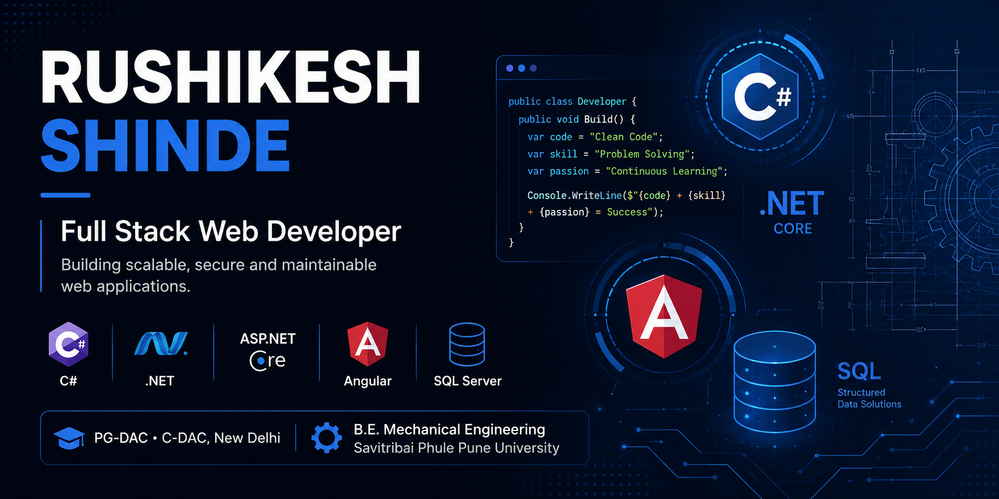

<p align="center">
  
</p>

<h1 align="center">Hey, I'm Rushikesh 👋</h1>

<p align="center">
  <b>Full Stack Developer</b>
</p>

<p align="center">
  <code>.NET</code> × <code>Angular</code> × <code>SQL</code>
</p>

<p align="center">
  <i>Code • Learn • Build • Improve</i>
</p>

---

## ⚡ My Tech Universe

<table align="center">
<tr>
<td align="center" width="25%">

### ⚙️ Backend

C#  
.NET  
ASP.NET Core  
Web API  

</td>

<td align="center" width="25%">

### 🎨 Frontend

Angular  
TypeScript  
JavaScript  
HTML / CSS  

</td>

<td align="center" width="25%">

### 🗄️ Data

SQL Server  
MySQL  
PostgreSQL  
EF Core  

</td>

<td align="center" width="25%">

### 🧩 Engineering

REST APIs  
SOLID  
Design Patterns  
Dependency Injection  

</td>
</tr>
</table>

---

## 🧠 Currently Exploring

```text
Clean Architecture
        ↓
Scalable APIs
        ↓
Modern Angular
        ↓
Cloud & DevOps
